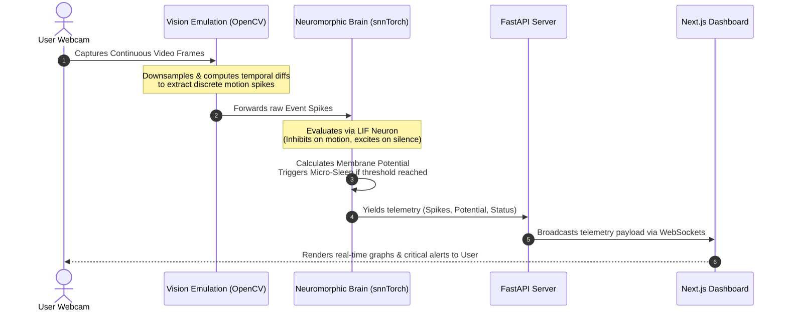

# Neuronex: Neuromorphic Anti-Drowsiness Dashboard

Neuronex is a real-time, event-driven anti-drowsiness detection system built upon neuromorphic engineering principles. Instead of using traditional frame-by-frame deep learning classifiers, Neuronex simulates a biological **Spiking Neural Network (SNN)** to monitor human alertness. 

By utilizing **snnTorch** and a Leaky Integrate-and-Fire (LIF) neuron model, the system accumulates a "sleep charge" during periods of spatial inactivity and resets dynamically when motion or blinking is detected, providing high-performance, real-time safety monitoring.

---

## 🚀 How It Works (Event-Driven Processing Loop)



1. **Vision Emulation Layer**: Traditional webcams capture full frames. The emulation layer processes these frames using OpenCV (downsampling and frame differencing) to emulate an Event Camera, extracting only the dynamic changes in light (spikes).
2. **Neuromorphic Processing**: The extracted event spikes are fed into an SNN. High spike counts (e.g., blinking, head movement) act as inhibitory drive, instantly dumping the neuron's membrane charge to zero. 
3. **Micro-Sleep Detection**: During periods of stillness (silence), a steady excitatory current is applied. Over time, this overcomes the biological leak and pushes the neuron's membrane potential toward its firing threshold (1.0), triggering a micro-sleep alert.
4. **Real-Time Telemetry**: A FastAPI local server runs the vision and SNN processing in a background loop at ~30 FPS, directly proxying the live telemetry data to the frontend via WebSockets.
5. **Dashboard Rendering**: The Next.js frontend seamlessly consumes the WebSocket stream, instantly updating progress bars, visual alerts, and telemetry numbers for the user.

---

## 🛠️ Technology Stack

* **Backend Environment**: Python, FastAPI, Uvicorn, WebSockets
* **Computer Vision**: OpenCV (`cv2`), NumPy
* **Neuromorphic ML**: PyTorch, snnTorch
* **Frontend Client**: Next.js 16 (App Router), React 19, Tailwind CSS 4, TypeScript

---

## 🚀 Getting Started

### Prerequisites
- Python 3.10+
- Node.js 20+
- A working Webcam

### 1. Run the Backend (FastAPI + SNN)

Navigate to the `backend/` directory, set up your virtual environment, and install dependencies.

```bash
cd backend
python -m venv .venv

# Activate Virtual Environment (Windows)
.venv\Scripts\activate
# Activate Virtual Environment (Mac/Linux)
source .venv/bin/activate

# Install dependencies
pip install -r requirements.txt

# Run the API server
python main.py
```
*The API will start on `http://0.0.0.0:8000` and listen for WebSocket connections on `/telemetry`.*

### 2. Run the Frontend (Next.js Dashboard)

Open a new terminal, navigate to the `frontend/` directory, install packages, and start the development server.

```bash
cd frontend

# Install Node modules
npm install

# Start the development server
npm run dev
```
*Open [http://localhost:3000](http://localhost:3000) in your browser. Ensure the backend is running so the WebSocket connects successfully.*

---

## 🔧 Configuration

Neuromorphic parameters can be tuned in `backend/src/config.py`:
- `DIFF_THRESHOLD` (default: 25): Sensitivity to pixel changes.
- `BLINK_SPIKE_LIMIT` (default: 15): Spikes required to reset the sleep timer.
- `MICRO_SLEEP_SEC` (default: 4.0): Seconds of inactivity before the alarm triggers.
